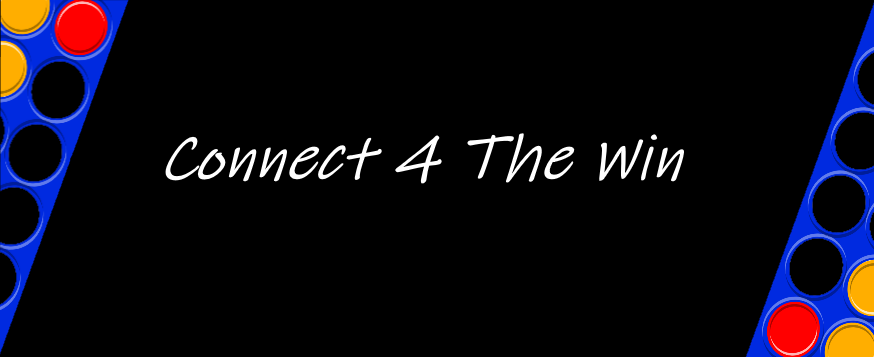

# Connect4TheWin Game
"Connect Fo(u)r the win" is an open source game written in VisualBasic.NET

# What is this??
This is a simple Connect 4 game designed for two people on the same computer who don't know how to have fun.

# What is required??
To launch this game is required a Computer who has Windows XP SP3 or better and also the .NET Framework 4 runtime installed. (Already installed on recent OS).
At the startup is required also an Internet Connetion.

# Why this name?
Connect 4 The Win stands for:
* **Connect four** The Win
* Connect **for the win**
